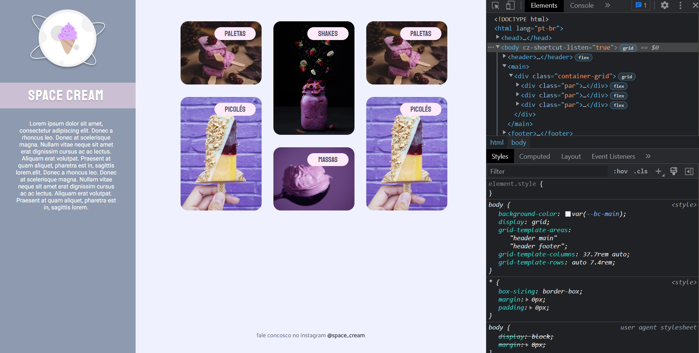

<h1 align="center"> Avançando CSS - Grid com Animações 💜 </h1>

  <a href="#-tecnologias">Tecnologias</a>&nbsp;&nbsp;&nbsp;|&nbsp;&nbsp;&nbsp;
  <a href="#-projeto">Projeto</a>&nbsp;&nbsp;&nbsp;|&nbsp;&nbsp;&nbsp;
  <a href="#-layout">Layout</a>&nbsp;&nbsp;&nbsp;|&nbsp;&nbsp;&nbsp;
  <a href="#memo-licença">Licença</a>

 

  

## 🚀 Tecnologias

Esse projeto foi desenvolvido com as seguintes tecnologias:

- HTML e CSS
- Git e Github
- Figma

## 💻 Projeto

Nesse projeto foi recriado uma aplicação avançada, a partir de um layout pronto no figma. Foi usado no código CSS conceitos de variaveis, configurações root, criação de animações e display Grid. 

## 🔖 Layout

Você pode visualizar o layout do projeto através [DESSE LINK](https://www.figma.com/file/9l0adrFCIzAxjfSZy7r5KK/Stage-03---Grid-com-anima%C3%A7%C3%B5es-(Copy)?node-id=0%3A3&t=jg8hQwG37TRVigsM-0). É necessário ter conta no [Figma](https://figma.com) para acessá-lo.

## :memo: Licença

Esse projeto está sob a licença MIT.

---

Feito com  ♥  by Alex Lima

Você pode acessar o Website do projeto através do link: 
<a href= "https://alima07.github.io/rocketseat-stage3-CSS-avancado-mobile-first" target="_blank"> Clique aqui ⏯ </a>

